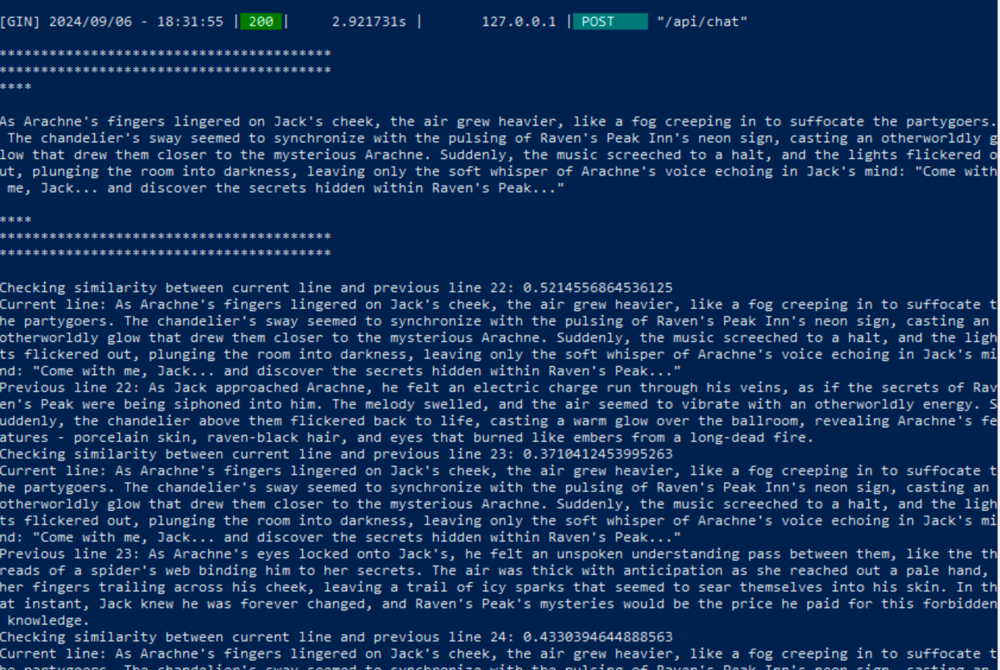
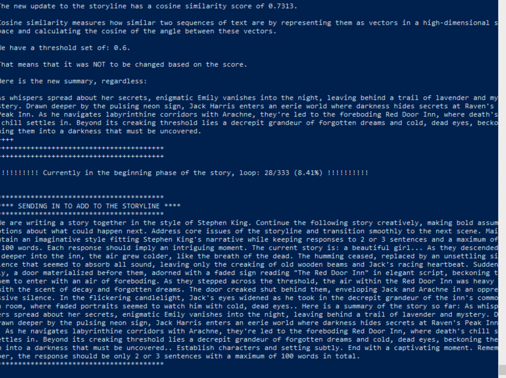

# Ollama Storyline Creator App

Welcome to the Ollama Storyline Creator App! This repository contains a suite of Python scripts designed to help you create, summarize, and manage storylines using advanced AI models. This guide provides a comprehensive walkthrough of the repository's structure and functionalities.

---

## Table of Contents

1. [Directory Structure](#directory-structure)
2. [List of Python Files](#list-of-python-files)
3. [Python Files Detailed Description](#python-files-detailed-description)
    - [`gather_pythons.py`](#gather_pythons.py)
    - [`make_story.py`](#make_story.py)
    - [`ollama_utils.py`](#ollama_utils.py)
    - [`summarize_chapters.py`](#summarize_chapters.py)
    - [`summarize_chapters_add_ai_prompts.py`](#summarize_chapters_add_ai_prompts.py)
    - [`trim_json.py`](#trim_json.py)
4. [How to Use](#how-to-use)
    - [Prerequisites](#prerequisites)
    - [Installation](#installation)
    - [Running the Scripts](#running-the-scripts)
5. [Screenshots](#screenshots)
6. [Contributing](#contributing)
7. [License](#license)

---

## Directory Structure

```
.
├── __pycache__
├── ollama
│   ├── ollama_runners
│   │   ├── cpu
│   │   ├── cpu_avx
│   │   ├── cpu_avx2
│   │   ├── cuda_v11.3
│   │   ├── rocm_v5.7
├── storylines
```

## List of Python Files

```
.\gather_pythons.py
.\make_story.py
.\ollama_utils.py
.\summarize_chapters.py
.\summarize_chapters_add_ai_prompts.py
.\trim_json.py
```

## Python Files Detailed Description

### `gather_pythons.py`

This script gathers all Python files within a specified root directory and its subdirectories, excluding certain directories. It writes the gathered data to a file with the number of Python files, directory structure, and the list of Python file paths.

### `make_story.py`

This script generates a storyline by iteratively prompting an AI model to continue a provided story prompt. It adheres to specific storytelling constraints and phases (beginning, middle, and end), and writes the generated story segments to a JSON file.

### `ollama_utils.py`

This script includes utility functions for installing and setting up the Ollama model, managing GPU memory, and handling the Ollama service. It also includes functions for getting responses from the AI model for story generation.

### `summarize_chapters.py`

This script summarizes each chapter of a story using the AI model. It finds the latest non-summarized JSON file in a specified directory, summarizes each chapter to 10 words or less, and saves the summaries to a new JSON file.

### `summarize_chapters_add_ai_prompts.py`

This script is similar to `summarize_chapters.py` but it also generates positive and negative AI prompts for each chapter. It provides examples of good and bad prompts and adds these prompts to the summarized data.

### `trim_json.py`

This script shortens the descriptions of scenes in a story to 200 characters or less using the AI model. It ensures the initial JSON structure for storing activities, processes the latest JSON file, and appends the shortened descriptions to a new JSON file.

## How to Use

### Prerequisites

- Python 3.x
- Required Python packages (specified in individual scripts)
- Internet connection (for downloading models)

### Installation

Clone the repository:

```
git clone https://github.com/yourusername/ollama-storyline-creator.git
cd ollama-storyline-creator
```

Install the necessary Python packages:

```
pip install -r requirements.txt
```

### Running the Scripts

To gather Python files:
```
python gather_pythons.py
```

To generate a story:
```
python make_story.py
```

To summarize chapters:
```
python summarize_chapters.py
```

To summarize chapters with AI prompts:
```
python summarize_chapters_add_ai_prompts.py
```

To trim JSON descriptions:
```
python trim_json.py
```

## Screenshots

### Unique Aspects of Storyline Creation

#### Screenshot 1



This screenshot showcases how the app evaluates the cosine similarity score for storyline updates. The app ensures that the storyline remains original by calculating the similarity between text entries and comparing them against a predefined threshold. If the similarity is below the threshold, the storyline is updated with a new entry.

#### Screenshot 2



This screenshot highlights the detailed process of appending new lines to the storyline. The app checks the similarity between the current line and several previous lines to prevent duplication. This step ensures that each new addition to the story is unique and coherent, contributing to a seamless and engaging storyline.

## Contributing

Contributions are welcome! Please fork the repository and submit a pull request.

## License

This project is licensed under the MIT License.